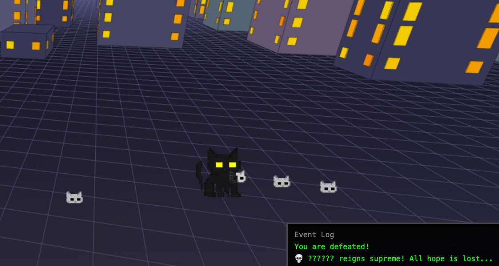
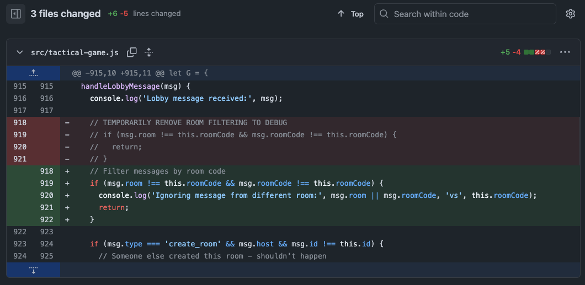

# Whoops…

  

Hey there!

If you go and play my 2025 JS13kGames submission Roll for Mischief you'll notice a lot of event log "noise" because room filtering was temporarily disabled prior to submission. That's unfortunate for what is without that bug a fairly solid game. I think I noticed this and passed it off as an issue with using the same room code (it wasn't)… you live and you learn :)

This was my first JS13k submission, and I went for the challenging Online category. I should have triple checked the broadcast code (fixed in the hours before I submitted). I'm more delighted I submitted roughly 6 hours before the deadline and caught a critical bug in the minimization code which rendered the code unplayable on JS13k.

In hindsight, I am posting a link to the fixed game as the "Directors Cut" also linked [here](https://html-preview.github.io/?url=https://github.com/azurewraith/roll-for-mischief/blob/main/dist/index.html). I encourage you to try it out if you liked the premise of what you saw on JS13kGames. I'll also post a YouTube of the gameplay without the broken event logs.

Thanks for playing!
